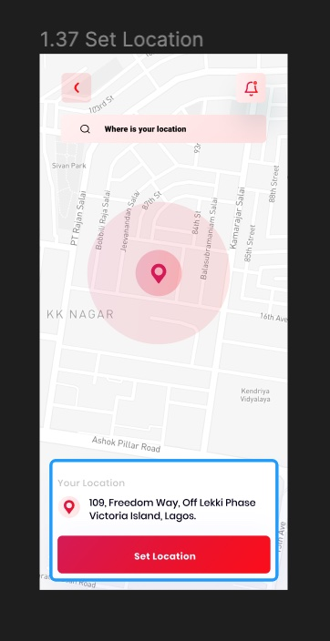

# Getir Android Kotlin Bootcamp w2 v2 Assignment

## Screenshots

</img> 

https://github.com/Getir-Android-Kotlin-Bootcamp/getir-android-kotlin-bootcamp-w2-v-2-assignment-SelenSonmez/assets/71898275/70979301-c2bb-43c9-ba5d-bbacd44fd6d7

## Features
- Search for locations using Google Places API
- View selected location on Google Maps
- Retrieve and display the address of selected locations
- Custom markers on the map to indicate user's location and selected places
- Asynchronous network operations using Kotlin coroutines

 ## Requirements
- Android Studio
- Google Maps API key
- Google Places API key

## Usage
1. Launch the Food Couriers app on your Android device.
2. Search for your location by typing in the search bar provided.
3. Select the desired location from the search results.
4. The selected location will be displayed on the map along with its address.
6. Custom markers will indicate your location and the selected place on the map.
### Yapılacaklar

1 - Set Location sayfasının tasarımının kodlanması

2- Sayfa açıldığında haritada mevcut konuma yönlendirilmesi
